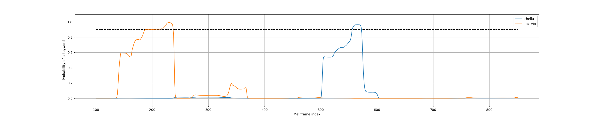

# QuartzNet
Implementation of [KWS model](https://arxiv.org/abs/1803.10916) in PyTorch

## Usage

### Setup
To launch and inference in nvidia-docker container follow these instructions:

0. Install [nvidia-docker](https://github.com/NVIDIA/nvidia-docker)
1. Run `./docker-build.sh`

### Training
To launch training follow these instructions:

1. Set preferred configurations in `config/config.yaml`
2. In `docker-run.sh` change `memory`, `memory-swap`, `shm-size`, `cpuset-cpus`, `gpus`, and data `volume` to desired values
3. Set WANDB_API_KEY environment variable to your wandb key
4. Run `./docker-train.sh`

All outputs including models will be saved to `outputs` dir.

### Inference
To launch inference run the following command:
```
./docker-inference.sh model_path device input_audio_path
```
Where:
* `model_path` is a path to lightning `.ckpt` model file
* `device` is the device to inference on: either 'cpu', 'cuda' or cuda device number
* `input_audio_path` is a path to input audio to find keywords in

Predicted output will be printed saved into a png file in `inferenced` folder.
Example of the output:



## Pretrained models
 [Download](https://drive.google.com/drive/folders/1ANzR9wXGANjO3wksI-nyFjqeYfqCxqQ9?usp=sharing)
